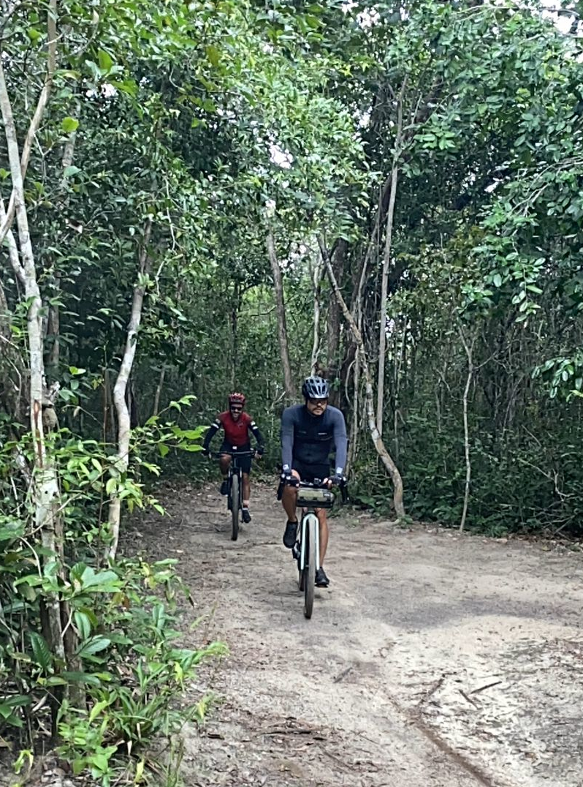

# About Us:

## EvoMol-Lab

The Laboratory of Evolution of Molecules and Systems (EvoMol-Lab) is one of the research groups associated with the [Bioinformatics Multidisciplinary Environment (BioME)](biome.ufrn.br), from the [Digital Metropolis Institute (IMD)](imd.ufrn.br) of the Federal University of Rio Grande do Norte ([UFRN](ufrn.br)). EvoMol-Lab's mission is to study evolutionary processes that act on molecules, supramolecular complexes, and systems (pathways and interaction networks) and the structural and functional effects caused by genetic variation, using approaches from bioinformatics, molecular modeling, and evolutionary sequence analysis. Its Principal Investigator is Prof. João Paulo MS Lima, Full Professor at UFRN.

## About me:

### Profissional

I am a Biologist (Bachelor) graduated from the Federal University of Ceará (UFC) (2000), Specialist in Bioinformatics (2002), Master (2003) and Doctor in Biochemistry (2007). My research formation included the areas of Biochemistry, Molecular Biology, and Bioinformatics. My main line of research today is the Evolution of Molecules and Metabolic Pathways, using approaches from Bioinformatics/Structural Bioinformatics and Molecular Phylogeny. I am currently a Full Professor of the Department of Biochemistry, Center for Biosciences of the Federal University of Rio Grande do Norte, permanent member of the [Postgraduate Program in Bioinformatics (PPg-Bioinfo-IMD/UFRN), researcher (P.I.) of the Multiuser Bioinformatics Center (CMB/IMD/UFRN)](bioinfo.imd.ufrn.br) and associate researcher of the Institute of Tropical Medicine of RN (IMT-RN).

- [OrcID](https://orcid.org/0000-0002-6113-8834)
- [ResearchGate](https://www.researchgate.net/profile/Joao-Lima-31)
- [LinkedIN](https://www.linkedin.com/in/jo%C3%A3o-paulo-ms-lima-b0667351/)

### Personal
Father of humans and dogs. Scientist, amateur cyclist (gravel enthusiast), and aspiring triathlete.

Mastodon: [@jpmslima@mstdn.science](https://mstdn.science/@jpmslima)

